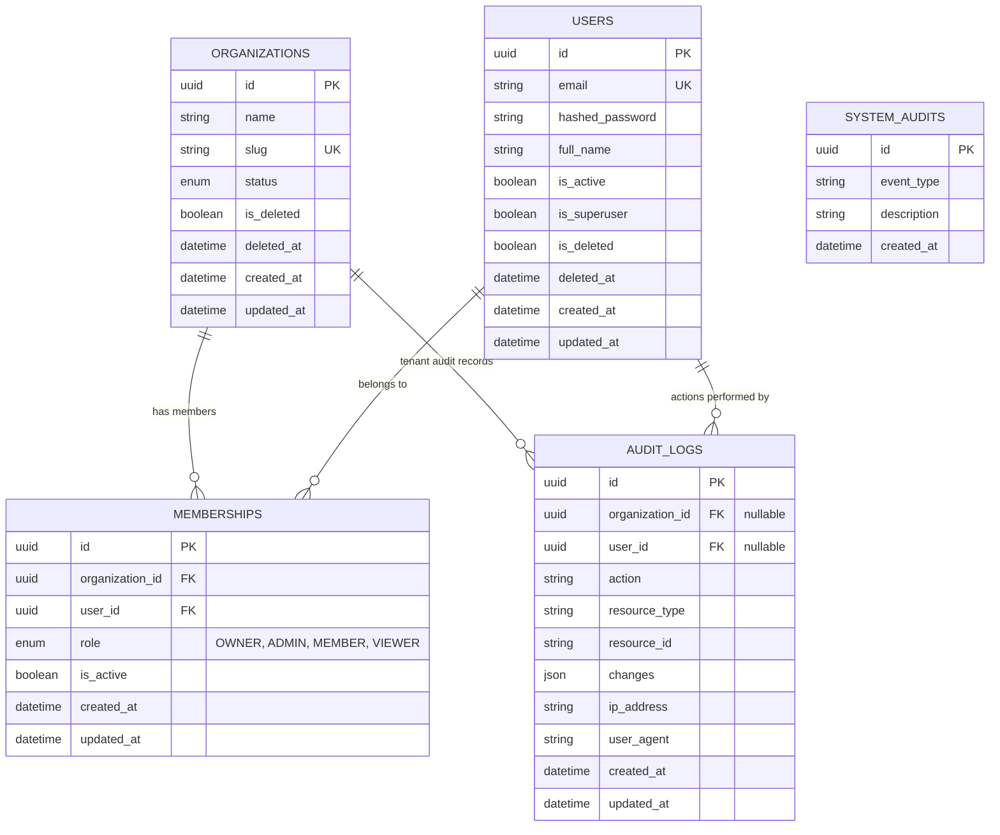

# Cortexa — Data Layer & Domain Model Specifications

This document outlines the core domain modeling conventions, database schemas, repository abstractions, transaction boundaries, and tenant isolation guarantees established in **Iteration 3: Core Data & Domain Layer**.

---

## 1. Entity-Relationship Architecture



---

## 2. Domain & Entity Conventions

### 2.1 Base Entity Models
- `BaseEntity`: All persistent models declare a primary key UUID (`id = uuid4()`) and timezone-aware UTC timestamps (`created_at`, `updated_at`).
- `TenantAwareEntity`: Extends `BaseEntity` with an `organization_id` foreign key referencing `organizations.id (ondelete CASCADE)`.
- `SoftDeleteMixin`: Provides logical deletion semantics (`is_deleted = False`, `deleted_at = None`). Soft-deleted records are automatically filtered out of queries unless explicitly queried with `include_deleted=True`.

### 2.2 Invariant Guarantees
1. **Lowercase Email & Slug normalization**: Emails and organization slugs are automatically lowercased and trimmed.
2. **Unique Composite Membership**: `(organization_id, user_id)` has a database-level unique constraint (`uq_memberships_org_user`) preventing duplicate memberships.
3. **Owner Protection**: An organization must have at least one active `OWNER`. Attempts to remove or demote the last remaining owner are blocked with a `400 Bad Request`.

---

## 3. Repository Layer Design

Data access is strictly separated into generic repository abstractions:

```
                  ┌──────────────────────┐
                  │    BaseRepository    │
                  └──────────┬───────────┘
                             │
              ┌──────────────┴──────────────┐
              ▼                             ▼
   ┌──────────────────────┐      ┌──────────────────────┐
   │   TenantRepository   │      │    UserRepository    │
   │  (organization_id    │      │ OrganizationRepo     │
   │   strictly enforced) │      │ MembershipRepository │
   └──────────────────────┘      │ AuditLogRepository   │
                                 └──────────────────────┘
```

### 3.1 Strict Tenant Isolation
For any entity inheriting `TenantAwareEntity`, all database queries are routed through `TenantRepository` where `organization_id` is a **mandatory argument**:
```python
# Guaranteed isolated tenant query:
async def get_by_id(self, organization_id: UUID, id: UUID) -> TenantModelType | None
async def list(self, organization_id: UUID, pagination: PaginationParams) -> tuple[Sequence[TenantModelType], int]
async def update(self, organization_id: UUID, instance: TenantModelType) -> TenantModelType
async def delete(self, organization_id: UUID, instance: TenantModelType) -> None
```

---

## 4. Service Layer & Transaction Management

The Service / Application Layer encapsulates business rules, coordinates repositories, and controls database transaction boundaries:

```python
class BaseService:
    @asynccontextmanager
    async def transaction(self) -> AsyncIterator[AsyncSession]:
        # Uses begin() or begin_nested() (savepoints) for atomic rollback
        ...
```

### Atomic Multi-Table Operations Example:
When creating an organization:
1. `Organization` record is inserted.
2. `Membership` record is inserted with `role = UserRole.OWNER`.
3. `AuditLog` entry is recorded.
4. If any step fails, the entire transaction rolls back cleanly.
5. Upon successful commit, an `OrganizationCreatedEvent` is published to the `event_dispatcher`.

---

## 5. Pagination, Sorting & Filtering Standards

### Query Parameters
- `page`: Page number (integer $\ge 1$, default: `1`).
- `page_size`: Page limit (integer between $1$ and $100$, default: `20`).
- `sort_by`: Field name (defaults to `created_at`). Validated against model attributes to prevent SQL injection.
- `order`: Direction (`asc` or `desc`, default: `desc`).

### Standardized Response Envelope
```json
// Single resource:
{
  "data": { "id": "...", ... },
  "meta": null
}

// Paginated collection:
{
  "data": [ ... ],
  "pagination": {
    "page": 1,
    "page_size": 20,
    "total_items": 42,
    "total_pages": 3,
    "has_next": true,
    "has_prev": false
  }
}
```

---

## 6. Audit & Domain Event Foundation

### Audit Trail
Every critical domain operation captures a structured immutable record:
- **WHO**: `user_id`
- **DID WHAT**: `action` (e.g. `organization.created`, `membership.added`, `membership.role_changed`)
- **TO WHICH RESOURCE**: `resource_type`, `resource_id`
- **IN WHICH TENANT**: `organization_id`
- **WITH WHAT CHANGES**: `changes` (JSON delta)
- **WHEN**: `created_at` (UTC timestamp)

### Domain Events Dispatcher
An asynchronous `EventDispatcher` routes typed domain events to local subscribers without introducing premature distributed queue infrastructure. When background workers or message brokers (Redis Streams / Kafka) are introduced in later iterations, they will plug directly into this dispatcher.
