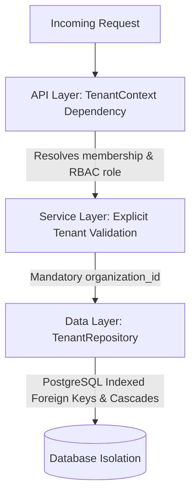

# Cortexa — Security & Multi-Tenancy Architecture

This document outlines the security controls, tenant isolation mechanisms, authentication workflows, and Role-Based Access Control (RBAC) policies implemented across Cortexa.

---

## 1. Multi-Tenant Isolation Strategy (Defense in Depth)

Cortexa enforces tenant isolation across three distinct architectural boundaries:

1. **Boundary 1: API Route Guards (`TenantContext`)**:
   - Every tenant endpoint requires the `get_tenant_context` dependency.
   - It decodes the JWT, verifies the caller's active membership in the target organization, and attaches the caller's verified `UserRole`. Non-members receive an immediate `403 Forbidden`.
2. **Boundary 2: Service Layer Parameterization**:
   - Services accept explicit `organization_id` parameters and check cross-tenant boundaries before mutating records.
3. **Boundary 3: Data Layer Enforced Scoping (`TenantRepository`)**:
   - Queries constructed by `TenantRepository` unconditionally inject `WHERE organization_id = :org_id`.
   - Mutation and deletion methods verify `instance.organization_id == organization_id` before executing updates.

---

## 2. Role-Based Access Control (RBAC) Matrix

| Permission / Action | OWNER | ADMIN | MEMBER | VIEWER |
| :--- | :---: | :---: | :---: | :---: |
| **View Organization Workspace** | ✅ | ✅ | ✅ | ✅ |
| **View Organization Members** | ✅ | ✅ | ✅ | ✅ |
| **Update Organization Settings** | ✅ | ✅ | ❌ | ❌ |
| **Invite / Add Members** | ✅ | ✅ | ❌ | ❌ |
| **Change Member Roles** | ✅ | ✅ | ❌ | ❌ |
| **Remove Members** | ✅ | ✅ | ❌ | ❌ |
| **View Audit Trail Logs** | ✅ | ✅ | ❌ | ❌ |
| **Delete / Archive Organization** | ✅ | ❌ | ❌ | ❌ |

---

## 3. Authentication & Password Hygiene

- **Password Storage**: Passwords are never stored in plaintext. They are salted and hashed using `bcrypt` directly.
- **JWT Tokens**: Session access tokens are signed using `HS256` with expiration lifetimes configured via `ACCESS_TOKEN_EXPIRE_MINUTES`.
- **Token Claims**: Access tokens carry the user UUID in the `sub` claim and validate timestamp bounds (`exp`, `iat`).

---

## 4. Audit Trail & Traceability

- Every administrative action, member addition, role change, and profile modification produces a structured `AuditLog` entry.
- Request correlation middleware tags every request with an `X-Request-ID` and client IP address, enabling end-to-end audit reconstruction.
- Audit records are immutable once persisted.
